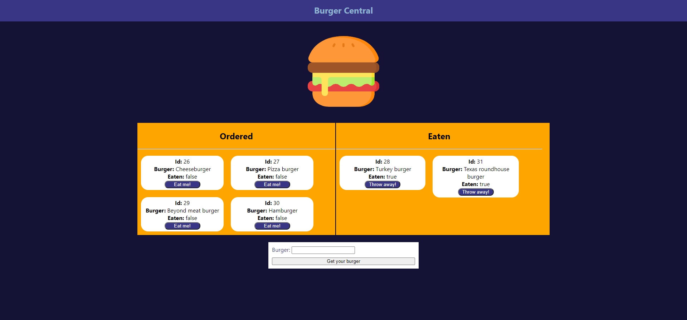

# Burger Ordering and Eating App

[Link to website](https://damp-beyond-81928.herokuapp.com/)

## Description 

This application is a very simple application that will let you input a burger you would like to order and eventually eat if you would like. Once it is ordered you can eat it and then throw away your trash. This is a very simple display of a model view controller, and the use of a custom created orm. Much larger and more complex applications can be built off of these foundational technologies.

## Usage

You can visit the [Link](https://damp-beyond-81928.herokuapp.com/) provided and this will take you to the Heroku deployed application. Since this is deployed on Heroku it utilizes JawsDB through Heroku to store the data. You will simpily put in the burger you would like to order and submit it. Afterwards it will display in the ordered category with the option for you eat the order. If you eat the order it will update the SQL database and move the order to the eaten category. Once it does this it will give the option to throw the trash away. If you choose this it will delete the burger from the SQL database.

## Credits

Website is built with [NodeJS](https://nodejs.org/en/), [ExpressJS](https://expressjs.com/), HTML, CSS, and JS

## License

Copyright (c) Allister Rampenthal. All rights reserved.

Licensed under the [MIT](https://choosealicense.com/licenses/mit/) license